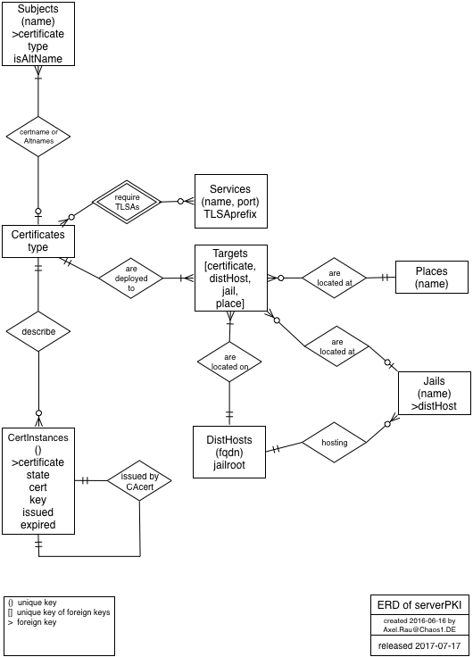
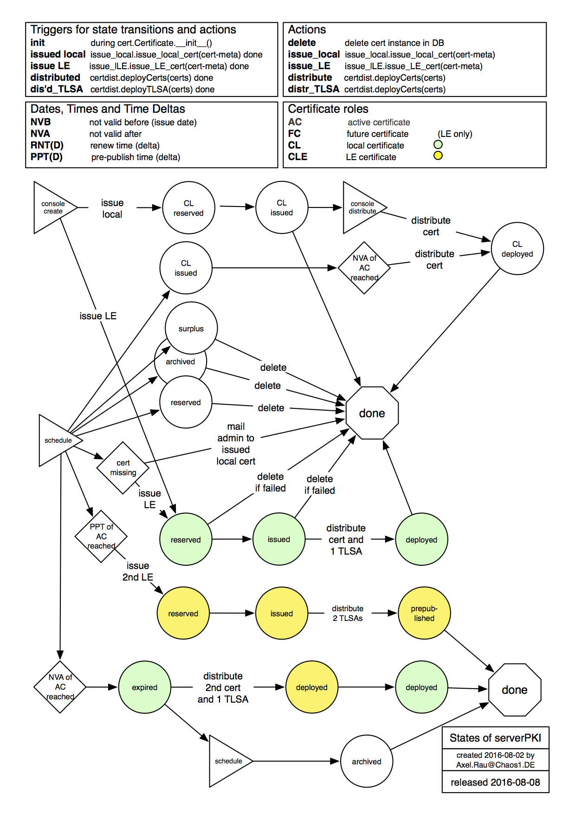

.. default-role:: any

.. index:: The database

.. _database:

The database
============

.. toctree::

.. index:: Model

.. _Model:

Model
-----

.. index:: entity relation diagram, ERD, id, created, updated, remarks

* The entity relation diagram shows 7 entities, related to certificates and
  their deployment. The normalized schema has rules and triggers to ensure
  integrity.
* Common columns - All relations have the following columns:

  * id - synthetic primary key
  * created - date and time of tuple creation
  * updated - date and time of last tuple update
  * remarks - arbitrary text

* columns, which together must be unique are in **bold**
  
This is the entity relation diagram:

.. index:: Tables

.. _Tables:

Tables
------

.. index:: Subjects, Subjects.name, Subjects.type, Subjects.isAltName, Subjects.certificate
.. index::
  see: Subject.certificate; Certificates

.. _Subjects:
.. _Subjects.name:
.. _Subjects.type:
.. _Subjects.isAltName:
.. _Subjects.certificate:

* **Subjects** - holds all the subject names

  * **name** - name of subject
  * type - subject type, one of
  
    * 'server' - server subject
    * 'client' - client (or personal) subject
    * 'CA' - certificate authority
    * 'reserved' - type of a placeholder, initially loaded

  * isAltName - true if subject is an alternate name
  * *certificate* - reference to Certificates

.. index:: Certificates.type, Certificates.disabled,
.. index:: Certificates.authorized_until, Certificates.encryption_algo,
.. index:: Certificates.ocsp_must_staple, Certificates
.. _Certificates:
.. _Certificates.type:
.. _Certificates.disabled:
.. _Certificates.authorized_until:
.. _Certificates.encryption_algo:
.. _Certificates.ocsp_must_staple:

* **Certificates** - one entry per defined certificate (holds cert meta data)

  * type - type of certificate, one of
  
    * LE - to be issued by Let's Encrypt CA
    * local - local cert (to be issued by local CA)

  * disabled - true means: Do not issue/create or distribute this cert.
  * authorized_until:

    * if type is 'LE': Needing new authorization with Let's Encrypt
      via DNS challenge after this date
    * if type is 'local': date and time of last mail to admin, to ask him to
      issue a new local cert

  * encryption_algo - encryption algorithm to be used by certs issued in the future, one of

    * rsa
    * ec
    * rsa plus ec

  * ocsp_must_staple - if true then the OCSP staple protocoll will be required by the cert
    (and server must be configured to support this)

.. index:: Certinstances.state, Certinstances.not_before, Certinstances.not_after
.. index:: Certinstances.
.. _Certinstances:
.. _Certinstances.state:
.. _Certinstances.not_before:
.. _Certinstances.not_after:
.. _Certinstances.certificate:
.. _Certinstances.cacert:
.. _Certinstances.ocsp_must_staple:

* **Certinstances** - issued certificate instances. 

  * id - the primary key. In case of local cert, id is the x509 serial.
  * state - state of instance (see :ref:`State Table <States>`), one of
  
    * reserved - being issued
    * issued - cert is issued (or renewed)
    * prepublished - cert published in DNS (vis TLSA RR) prior to usage
    * deployed - cert is distributed and in use by server
    * revoked - cert is revoked
    * expired - cert is expired
    * archived - cert is archived (will be removed soon)

  * not_before - start date and time for cert usage
  * not_after - end date and time for cert usage
  * *certificate* - reference to cert in Certificates
  * *cacert* - reference to cacert instance in Certinstances, describing
    CA which issued this cert
  * ocsp_must_staple - True, if this instance requires OCSP must staple

There may be more than one tuple per cert type, if cacerts are renewed.

Here is the state transition diagram:

.. index:: CertKeyData, CertKeyData.encryption_algo, CertKeyData.cert, CertKeyData.key,
.. index:: CertKeyData.hash
.. _CertKeyData:
.. _CertKeyData.encryption_algo:
.. _CertKeyData.cert:
.. _CertKeyData.key:
.. _CertKeyData.hash:

* **CertKeyData** - the cert/key material (one tuple per algorithm).

  * encryption_algo - encryption algorithm, used with this cert

    * rsa
    * ec

  * cert - the certificate in binary PEM format
  * key - the key in binary PEM format (encrypted, if DB encryption in use)
  * hash - the binascii presentation of the SHA256 hash of the certificate

.. index:: Services.name, Services.port, Services.TLSAprefix, services
.. _Services:
.. _Services.name:
.. _Services.port:
.. _Services.TLSAprefix:

* **Services** - stores service and port combinations for TLSA RR

  * **name** - name of service
  * **port** - tcp/udp port number of service
  * TLSAprefix - named zone resource record entry with place holder for hash,
    something like:
    
    _443._tcp.{}. 3600 IN TLSA 3 0 1  

* **Certificates_Services** - junction relation between Certificates and Services

  * **certificate** - reference to cert in Cerificates
  * **service** - reference to service in Services

.. index:: Jails.name, Jails.disthost, Jails
.. _Jails:
.. _Jails.name:
.. _Jails.disthost:

* **Jails** - One row describes one jail. A jail is a hosted entity on FreeBSD's
  lightweight virtualization environment. serverPKI connects to the jail host
  (Disthost) and places certs and keys on the jail, using the filesystem view
  of the host. 

  * **name** - name of jail
  * *disthost* - reference to the disthost, hosting the jail in Disthosts

.. index:: Disthosts.FQDN, Disthosts.jailroot, Disthosts
.. _Disthosts:
.. _Disthosts.FQDN:
.. _Disthosts.jailroot:

* **Disthosts** - One row per host to which cert and key should be distributed.

  * **FQDN** - fully qualified domain name of disthost
  * jailroot - optional path to root of jails on disthost.
    If empty, no jails are on this disthost.

.. index:: Places.name, Places.cert_file_type, Places.cert_path, Places.key_path 
.. index:: Places.uid, Places.gid, Places.mode, Places.chownboth 
.. index:: Places.pglink, Places.reload_command, Places
.. _Places:
.. _Places.name:
.. _Places.cert_file_type:
.. _Places.cert_path:
.. _Places.key_path:
.. _Places.uid:
.. _Places.gid:
.. _Places.mode:
.. _Places.chownboth:
.. _Places.pglink:
.. _Places.reload_command:

* **Places** - Place, where to deploy cert deployment details, related to one
  cert / disthost (or jail) combination.
  
  * **name** - name of place
  * cert_file_type - one of

    * 'cert only' - deploy only cert, no key
    * 'separate' - cert and key are in separate file
    * 'combine key' - cert and key are combined in one file
    * 'combine cacert' - cert is combined with cacert (intermediate if LE),
      key is in separate file
    * 'combine both' - cert is combined with both key and cacert

  * cert_path - absolute path of cert directory with placeholder '{}' of login
  * key_path - absolute path of key, if different from cert_path
  * uid - let key file be owened by uid
  * gid - let key file be owned by gid
  * mode - mode of key file if different from 0o400
  * chownboth - set owner of cert file to that of key file
  * pglink - link cert / key file to postgresql.crt / postgresql.key
  * reload_command - command to reload service after distribution of cert/key.
    In case of jail, '{}' is the placeholdfer for the jail name.

.. index:: Targets, Targets.distHost, Targets.jail, Targets.place, Targets.certificate 
.. _Targets:
.. _Targets.distHost:
.. _Targets.jail:
.. _Targets.place:
.. _Targets.certificate:

* **Targets** - binds one place, disthost/jail to a certificate

  * **distHost** - references distHost
  * **jail** - references jail
  * **place** - references place
  * **certificate** - references certificate

.. index:: Revision, Revision.schemaVersion, Revision.keysEncrypted 
.. _Revision:
.. _Revision.schemaVersion:
.. _Revision.keysEncrypted:

* **Revision** - holds revision of schema and key encryption state of DB

  * schemaVersion - Version of database schema
  * keysEncrypted - True, if keys are encrypted

.. index:: Views

.. _Views:

Views
-----

Some views simplify common queries. For each view the result columns are listed.

.. index:: certs

* **certs** - display meta information about a certificate

  * Subject - :ref:`Subject type <Subjects.type>`
  * Cert Name - :ref:`Subject name <Subjects.name>`
  * Type - :ref:`Type of certificate <Certificates.type>`
  * algo - :ref:`Cert encryption algorithm <Certificates.encryption_algo>`
  * ocsp_ms - :ref:`Cert ocsp_must_staple attribute  <Certificates.ocsp_must_staple>`
  * authorized - :ref:`authorized until <Certificates.authorized_until>`
  * Alt Name - :ref:`Alternative cert name <Subjects.name>`
  * TLSA - :ref:`Service name <Services.name>`
  * Port - :ref:`Service port number <Services.port>`
  * Dist Host - :ref:`Disthost name <Disthosts.FQDN>`
  * Jail - :ref:`Jail name <Jails.name>`
  * Place - :ref:`Place name <Places.name>`

.. index:: certs_ids

* **certs_ids** - like certs, but include primary keys of referenced tables

  * c_id - cert id
  * s1_id - subject id of none-altname subject
  * Subject Type - :ref:`Subject type <Subjects.type>`
  * Cert Name - :ref:`Subject name <Subjects.name>`
  * Type - :ref:`Cert type <Certificates.type>`
  * algo - :ref:`Cert encryption algorithm <Certificates.encryption_algo>`
  * ocsp_ms - :ref:`Cert ocsp_must_staple attribute  <Certificates.ocsp_must_staple>`
  * authorized - :ref:`authorized until <Certificates.authorized_until>`
  * s2_id - subject id of Alternative cert name subject
  * Alt Name - :ref:`Alternative cert name <Subjects.name>`
  * s_id - service id
  * TLSA - :ref:`Service name <Services.name>`
  * Port - :ref:`Service port number <Services.port>`
  * t_id - target id
  * d_id - disthost id
  * FQDN - :ref:`Disthost name <Disthosts.FQDN>`
  * j_id - jail id
  * Jail - :ref:`Jail name <Jails.name>`
  * p_id - place id
  * Place - :ref:`Place name <Places.name>`
  
  
.. index:: inst

* **inst** - display certificate instances (one row per issued cert instance per algorithm)

  * id - serial of cert instance
  * name - :ref:`Subject name <subjects.name>`
  * type - :ref:`Cert type <Certificates.type>`
  * state - :ref:`State of instance <Certinstances.state>`
  * cacert - reference to cacert instance in Certinstances, describing
    CA which issued this cert
  * ocsp_must_staple - if true then the OCSP staple protocoll will be required by the cert
  * not_before - :ref:`Start date for cert usage <Certinstances.not_before>`
  * not_after - :ref:`End date for cert usage <Certinstances.not_after>`
  * algo - :ref:`Cert encryption algorithm <CertKeyData.encryption_algo>`
  * hash - :ref:`Hash of cert <CertKeyData.hash>`

.. index:: Functions

.. _Functions:

Functions
---------

Functions are provided for common operations to abstract foreign key handling.
All arguments are text (mostly case insensitive [=citext]), exceptions are mentioned (e.g. boolean),
to omit an argument, use *null*.
Functions may be called with select in psql::

    serverpki=> select * from add_cert('test.com', 'server', 'local', 'www.test.com', NULL, NULL, NULL, NULL, NULL);
                      add_cert                  
    --------------------------------------------
     (server,test.com,local,,www.test.com,,,,,)
    (1 row)
    serverpki=> \q

.. index:: add_cert

* **add_cert** - add a new cert to the database

  * the_name - :ref:`Subject name <Subjects.name>`
  * the_subject_type - :ref:`Subject type <Subjects.type>`
  * the_cert_type - :ref:`Cert type <Certificates.type>`
  * the_encryption_algo - :ref:`Cert encryption algorithm <Certificates.encryption_algo> of related CertKeyData row`
  * must_staple - if true then the OCSP staple protocoll will be required by the cert
  * the_altname - optional :ref:`Alternative cert name <Subjects.name>`
  * the_tlsa_name - optional :ref:`Service name <Services.name>`
  * the_tlsa_port - optional :ref:`Service port number <Services.port>`
  * the_disthost_name - optional :ref: `Name of disthost <Disthosts.name>`
  * the_jail - optional :ref:`Jail name <Jails.name>`
  * the_place - optional :ref:`Place name <Places.name>`

.. index:: remove_cert

* **remove_cert** - delete a cert **and all issued cert instances with there CertKeyData from the database**

  * the_cert_name - :ref:`Subject name <Subjects.name>`

.. index:: add_altname

* **add_altname** - add an alternative name to an existing cert in the database

  * the_cert_name - :ref:`Subject name <Subjects.name>` to identify the cert, to which the altname should be added
  * the_altname - :ref:`Alternative cert name <Subjects.name>` to add

.. index:: remove_altname

* **remove_altname** - remove an alternative name from the database

  * the_altname - :ref:`Alternative cert name <Subjects.name>` to be removed

.. index:: add_service

* **add_service** - add an :ref:`existing service <Services>` to a certificate

  * the_cert_name - :ref:`Subject name <Subjects.name>` to identify the cert, to which the service should be added
  * the_service_name -  :ref:`Service name <Services.name>`
  * the_port -  :ref:`Service port number <Services.port>`

.. index:: remove_service

* **remove_service** - remove a :ref:`service <Services>` from a certificate

  * the_cert_name - :ref:`Subject name <Subjects.name>` to identify the cert, from which the service should be removed
  * the_service_name -  :ref:`Service name <Services.name>`
  * the_port -  :ref:`Service port number <Services.port>`

.. index:: add_target

* **add_target** - add a :ref:`target <Targets>` to a certificate

  * the_name - :ref:`Subject name <Subjects.name>` to identify the cert, to which the target should be added
  * the_disthost_name - :ref:`Disthost name <Disthosts.FQDN>` to identify the :ref:`target <Targets>`
  * the_jail - optional :ref:`Jail name <Jails.name>` to identify the :ref:`target <Targets>`
  * the_place - optional :ref:`Place name <Places.name>` to identify the :ref:`target <Targets>`

.. index:: remove_target

* **remove_target** - remove a :ref:`target <Targets>` from a certificate

  * the_cert_name - :ref:`Subject name <subjects.name>` to identify the cert, from which the target should be removed
  * the_disthost_name - :ref:`Disthost name <Disthosts.FQDN>` to identify the :ref:`target <Targets>`
  * the_jail - optional :ref:`Jail name <Jails.name>` to identify the :ref:`target <Targets>`
  * the_place - optional :ref:`Place name <Places.name>` to identify the :ref:`target <Targets>`

